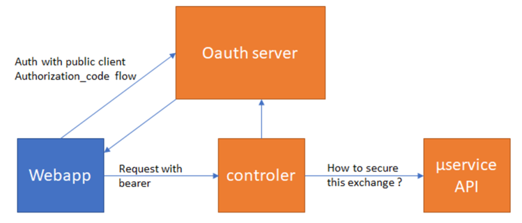

# please-open.it

* Keycloak as a service provider
* oauth2/openid connect consulting

*you don't need to be an oauth2 expert*

---

# Me ?


* Mathieu PASSENAUD (@mathieupassenau)
* Years of experience in authentication (oauth2, JWT, certs, LDAP...)
* authentication warrior

---

## What we will do during this session ?

* Quick tour of oauth2
* How to connect our web app
* Verify a user access
* Retrieve user informations
* Open your api to partners

---

### Keycloak

*Keycloak is a powerful application which allows you to **add authentication to applications and secure your services**. No more need to implement an nth time username/password auth with lost password e-mail, etc... All common user management operations are available out of the box. It comes with a full set of advanced features including User Federation, Identity Brokering and Social Login.*

From Redhat

---

# Quick Tour of Oauth2

--

 *OAuth 2.0 provides specific authorization flows for web applications, desktop applications, mobile phones, and smart devices.*

 [https://en.wikipedia.org/wiki/OAuth#OAuth_2.0](https://en.wikipedia.org/wiki/OAuth#OAuth_2.0)

--

*OAuth is an open standard for **access delegation**, commonly used as a way for **Internet users to grant websites or applications access to their information on other websites** but without giving them the passwords.*

*This mechanism is used by companies such as Amazon, Google, Facebook, Microsoft and Twitter to permit the users to share information about their accounts with third party applications or websites.*

--

# Token
- Session ID
- JWT Token

- access_token
- refresh_token

--

Header : 

```{ "alg": "HS256", "typ": "JWT" } ```

Content : 

```{ "sub": "123456789", "name": Mathieu P"}```

--

hmac = Base64(header).Base64(data)

Base64(header).Base64(data).Base64(hmac)

--

# Client
- client == app
- public / private
- Application's authentication
- roles

--

## identified by 
- client_id
- client_secret
- redirect_uri
- domain (cors)

---

# get a token
*also called : authentication*

--

# client credentials
*Authenticate an app, without a user*

--



--

Basic oauth2 authentication

*App authentication*

--

```bash
 curl --location --request POST 'https://sso.com/token' 
 --header 'Content-Type: application/x-www-form-urlencoded' 
 --data-urlencode 'client_id=' 
 --data-urlencode 'client_secret=' 
 --data-urlencode 'grant_type=client_credentials'  
```

--

# demo

--

# Client + user

--

### Authorization code flow


--

- 1. Request an authentication
- 2. Redirect to authentication form
  - client_id
  - redirect uri
  - scopes
- 3. Submit credentials
- 4. Redirect user with 302 to redirect_uri with authorization code
- 5. Exchange authorization code to token with POST

--

# no implicit grant 


--

# Redirect uri is a piece of security

--

## Token is sent in every request, in a "authorization" header

--

# Demo

[https://developers.google.com/oauthplayground/](https://developers.google.com/oauthplayground/)

[https://playground.please-open.it](https://playground.please-open.it)

---

# token verification
*Called "introspection"*

--

## We need a second client for our backend

A private client, with client_id and client_secret

--

POST /token_introspect

* client_id
* client_secret
* token

--

# DEMO

[https://developer.okta.com/blog/2020/01/15/protecting-a-php-api-with-oauth](https://developer.okta.com/blog/2020/01/15/protecting-a-php-api-with-oauth)

---

# ROLES

--

*From a client*

*to a user*

--

### Filter on token introspection

---

# SCOPES
*What we want ?*

--

Data or roles

--

# user consent

--

# DEMO
